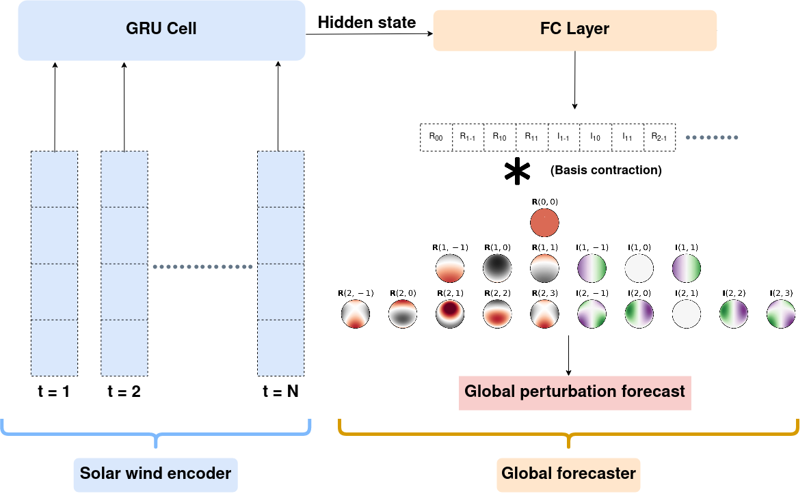

# Geo-effectiveness 2020

*A full-earth ground magnetic perturbation forecasting model using deep learning*

### Overview

**Need and Challenge**: The solar wind is a stream of particles that starts from the Sun and fills the interplanetary medium. As it bellows past the various planets, it undergoes complex and non-linear interaction with their respective magnetospheres, giving rise to space weather effects. On Earth, this interaction is measured on the ground as perturbations in Earth’s magnetic field by magnetometers scattered all over the planet. In this work, we forecast the ground magnetic perturbations across the whole Earth in a grid-free manner given only the solar wind measurements.

**Results**: We develop a deep learning pipeline consisting of a Gated Recurrent Unit (GRU) → Multilayer Perceptron (MLP) → Spherical Harmonic Layer (SHL). We summarize 2-hours of solar wind conditions measured at L1 point (from the OMNI dataset) using the GRU cell  to generate a summary "hidden state" of the solar wind measurements. This state is then passed to a fully-connected layer of MLP to generate a vector of “coefficients”. These coefficients are then contracted with a basis of spherical harmonics which is generated every forward pass depending on the locations of the different stations which have measurements. The output after the contraction operation is a set of magnetic perturbation measurements at each station location. This scheme is diagrammatically summarized in Fig. 1.

**Figure 1**: The ground magnetic perturbation scheme using Deep learning with spherical harmonics. 

**This work has been submitted to a peer-reviewed journal** 

---

